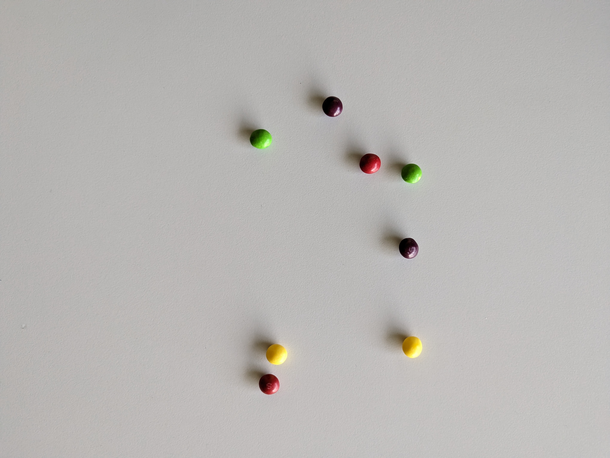

# Wprowadzenie do Systemów Wizyjnych

## Politechnika Poznańska, Instytut Robotyki i Inteligencji Maszynowej

<p align="center">
  
</p>

# **Projekt zaliczeniowy: zliczanie cukierków**

## Zadanie

Zadanie projektowe polega na przygotowaniu algorytmu wykrywania i zliczania kolorowych cukierków znajdujących się na zdjęciach. Dla uproszczenia zadania w zbiorze danych występują jedynie 4 kolory cukierków:
- czerwony
- żółty
- zielony
- fioletowy

Wszystkie zdjęcia zostały zarejestrowane "z góry", ale z różnej wysokości i pod różnym kątem. Ponadto obrazy różnią się między sobą poziomem oświetlenia oraz oczywiście ilością cukierków.

Poniżej przedstawione zostało przykładowe zdjęcie ze zbioru danych i poprawny wynik detekcji dla niego:

<p align="center">
  
</p>


```bash
{
  ...,
  "37.jpg": {
    "red": 2,
    "yellow": 2,
    "green": 2,
    "purple": 2
  },
  ...
}
```

## Struktura projektu

Szablon projektu zliczania cukierków na zdjęciach dostępny jest w serwisie [GitHub](https://github.com/PUTvision/WDPOProject) i ma następującą strukturę:

```bash
.
├── data
│   ├── 00.jpg
│   ├── 01.jpg
│   └── 02.jpg
├── readme_files
├── detect.py
├── README.md
└── requirements.txt
```

Katalog [`data`](./data) zawiera przykłady, na podstawie których w pliku [`detect.py`](./detect.py) przygotowany został algorytm zliczania cukierków. 

## Wywołanie programu

Skrypt `detect.py` przyjmuje 2 parametry wejściowe:
- `data_path` - ścieżkę do folderu z danymi (zdjęciami)
- `output_file_path` - ścieżkę do pliku z wynikami

```bash
$ python3 detect.py --help

Options:
  -p, --data_path TEXT         Path to data directory
  -o, --output_file_path TEXT  Path to output file
  --help                       Show this message and exit.
```

W konsoli systemu Linux skrypt można wywołać z katalogu projektu w następujący sposób:

```bash
python3 detect.py -p ./data -o ./results.json
```

## Ewaluacja rozwiązań

Algortymu zliczania cukierków jest oceniany na podstawie poniższeo wzoru:

<p align="center">
  
</p>

Gdzie:
-  oznacza liczbę obrazów
-  oznacza rzeczywistą ilość danego koloru
-  oznacza przewidzianą ilość danego koloru
